**WioLTEと加速度センサでEdgeAIを体験しようハンズオン**
===============================================

　このハンズオンではWioLTE上でのニューラルネットワークの実装とSORACOM プラットフォームとの連携方法について学習します。

　ハンズオンの題材として加速度センサを利用した機械の振動監視システムを構築します。このアプリケーションは機械の利用状況の確認や、特定の状態の監視を想定しています。

　このハンズオンを通して以下の知識を獲得することを目標とします。

* ニューラルネットワークの基礎知識
* TensorFlwo Lite for microcontrollersを利用したEdge-AIの実装
* EdgeAIとSORACOMプラットフォームとのインテグレーション

### **ハンズオンを進めるにあたって必要な知識**

* WioLTEの基礎知識
* SORACOM プラットフォームの基礎知識

### **ハンズオンで実装するアプリケーション**

**アプリケーションの概要**

　加速度センサを利用した機械の振動監視システムを構築します。今回はデバイスとしてWioLTE JP Verを利用します。加速度センサを振動を監視したい機械に設置し、振動を計測します。今回は監視対象の機械の代わりにWioLTE JP Verのキットに含まれるブザーを利用します。ブザーの音を振動として加速度センサで計測します。計測された加速度はWioLTE上のEdge AIで処理され、ブザーの動作状態のみがSORACOM Harvestへ送られ可視化されます。
<br>
>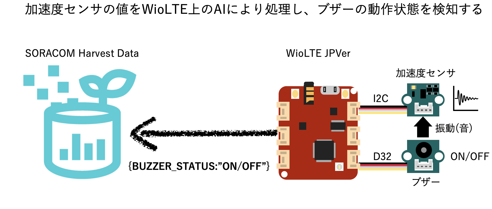
<br><br>

**ハンズオンの内容につて**

ハンズオンでは[TensorFlow Lite for microcontrollers](https://www.tensorflow.org/lite/microcontrollers?hl=ja)を利用したWio LTEでのEdge AIの実現方法とSORACOM Harvest Dataでの可視化方法について学習します。以下のオーバービューに示す通り6つのステップで構成されています。

>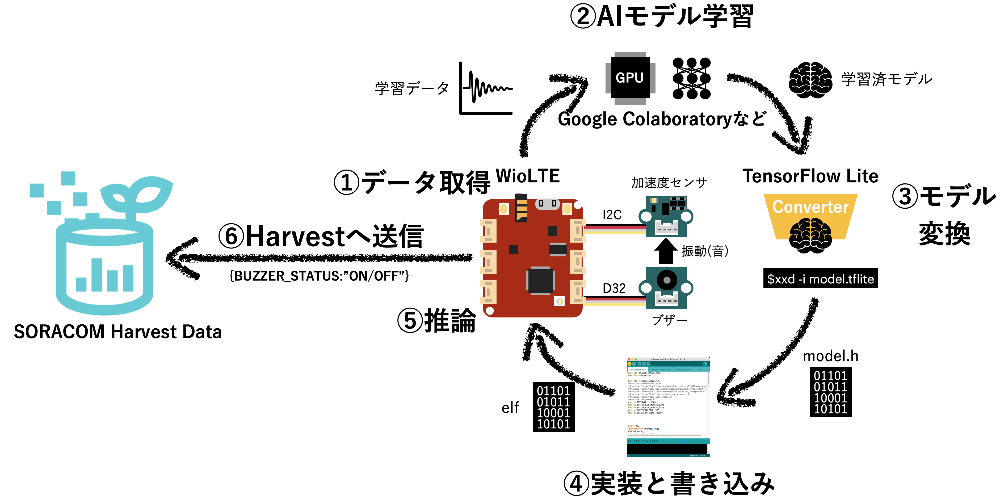
<br><br>

1. 学習データの収集
2. AIモデルの学習
3. AIモデルの変換
4. WioLTEへのプログラムの実装と書き込み
5. 推論の実行
6. SORACOM Harvest Dataでの可視化
<br><br>

## **事前準備**


**WioLTE開発環境の準備**

* Windowsの環境構築

https://soracom.github.io/jp-training/WioLTE/0/prepare-win

* macOSの環境構築

https://soracom.github.io/jp-training/WioLTE/0/prepare-win


**WioLTEの利用方法及動作確認**

https://soracom.github.io/jp-training/WioLTE/1/1-setup


**pyserialのインストール**

WioLTEからシリアルでデータを受信してファイルに保存する必要があります。以下の環境を構築してください。

* Python3のインストール
* pyserialのインストール

Python3インストール後、ターミナルまたはコマンドプロンプトから以下のコマンドを実行します。

```shell
python3 -m pip install pyserial
```


## **ハンズオン**

### **1. ハードウェアのセットアップ** 
<br>

**手順1. WioLTE必要な部品を取り付ける**

 * LTE通信用アンテナ
 * ボタン => D20
 * ブザー => D38
 * 加速度センサ => I2C

>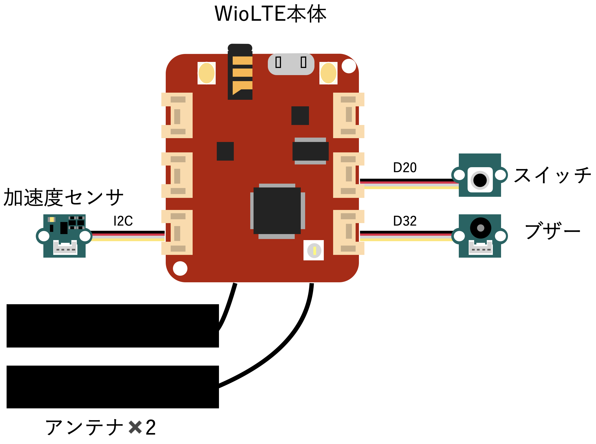
<br><br>


**手順2. 加速度センサーとブザーの貼り合わせ**

ブザーの振動(音)が加速度センサーへ伝わるように、２つのセンサを貼り合わせ、テープで固定します。貼り合わせの際にはお互いの部品を傷つけないように、突起物を避けて貼り合わせします。

>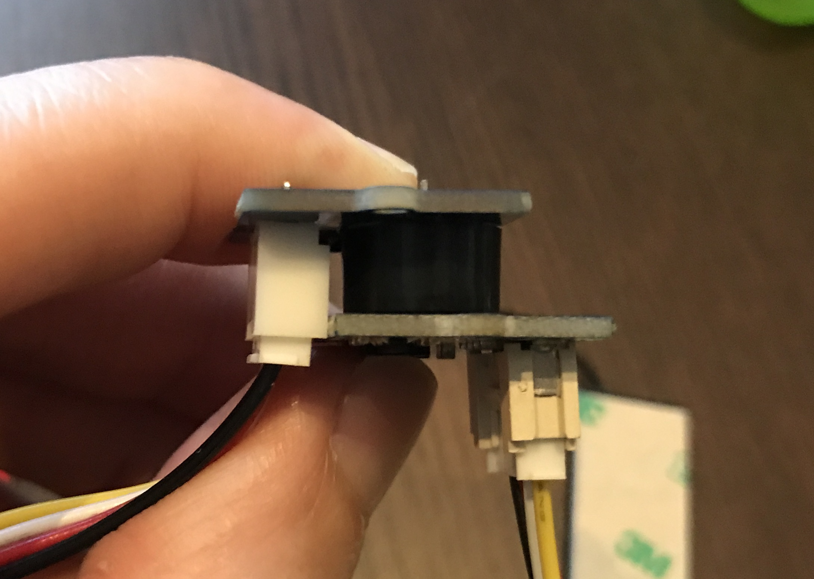
<br><br>


**手順3. SORACOM Air SIMの取り付け**

以下のページを参考にSIRACOM Air SIMをWioLTEへ取り付けます。

[WioLTEへのSORACOM Air SIMの取り付け方](https://soracom.github.io/jp-training/WioLTE/1/2-uptime.html)
<br><br>


### **2. 教師データの収集**

AIを学習させるためのデータを収集します。実際に、ブザーをON/OFFし、加速度センサの値を収集します。
<br><br>


**手順1. WioLTEへロガー用ファームウェアを書き込む**

データを収集するため、WioLTEへデータロガー用のファームウェアを書き込みます。このサンプルプログラムはWioLTEに接続した３軸加速度センサの値をシリアル通信で送信します。また、ボタンを押すことで、ブザーを鳴らすことができます。


```buzzer-acc-logger/buzzer-acc-logger.ino```をArduino IDEで開き、WioLTEへ書き込みを行います。


書き込み終了後、WioLTEのリセットボタンを押下し、Arduino IDEのシリアルプロッタを開き、加速度のデータが送られてきいるか、確認します。また、WioLTEに取り付けたボタンを押下して、ブザーがなった場合に加速度が変化することを確認します。

> 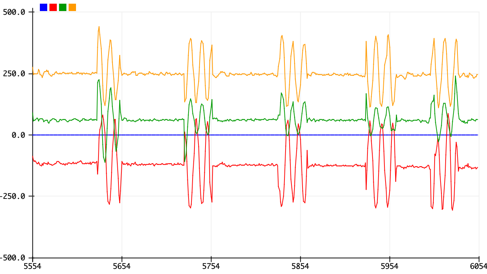
<br><br>


**手順2. シリアルデータロガーの実行**

```tools/loggercsv.py```を実行して、シリアル通信で送られてくる加速度センサの値をCSV形式で保存します。

以下のコマンドを実行後、10秒後にファイルへの記録が開始されます。

```bash
python tools/loggercsv.py -p <シリアルポート名> -f <csvファイル名>
```
* 例

```bash
python tools/loggercsv.py -p /dev/cu.usbserialxxxxxx -f sample/own_train_data.csv

```
***<span style="color: red; ">実行にはpyserialモジュールが必要になるので、あらかじめインストールを行ってください。</span>***

<br><br>


**手順3. データの収集**

ロギング開始後、loggercsvの出力に収集したデータ数が表示されます。

* ブザーなしのデータを集める。
　ブザーがなっていない状態で加速度センサの向きを複数の方向にゆっくりと変えながらデータを取得します。取得するデータ数が25000程度になるまで実行します。完了したら、そのままブザーありのデータを集めます。

* ブザーありのデータを集める。
　WioLTEに接続したボタンを押すとブザーがなり始めます。ブザーがなったまま、加速度センサの向きをゆっくりと変えてデータを取得します。ブザーなしのデータから連続して50000程度のデータ(ブザーありのデータが25000程度)を取得してください。

十分な量のデータを取得した後に、```loggercsv.py```をCtr+cで停止させてデータの収集を完了します。
<br><br>


### **3. AIの学習**

収集したデータを元にAIの学習を行います。AIの学習はTensorFlowが搭載されたマシンで実行します。このハンズオンではGoogle Colaboratoryを利用して、AIの学習を実行します。
<br><br>

**手順1. Google Colaboratoryの準備**

以下のボタンを押下して、学習用のノートブックをGoogle Colaboratoryで開きます。Googleアカウントへのログインが求められる場合はログインしてください。

[](https://colab.research.google.com/github/masato-ka/wiolte-ai-handson/blob/master/tools/ai_wiolte_train_pynb.ipynb)
<br><br>

Google Colaboratoryは「ランタイム」->「ランタイムの変更」からGPUランタイムを選択してください。

**手順2. 学習データのアップロード**

「2. 教師データの収集」で収集した、加速度データのCSVファイルをGoogle Colaboratoryへアップロードします。Google Colaboratory左側の①フォルダマークを選択して、上部に表示される②アップロードボタンを押下します。

> 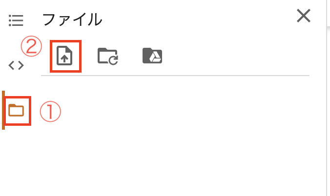


ファイル選択画面から、加速度センサの値が記録されたCSVファイルを選択肢、アップロードします。
<br><br>


**手順3. 学習の実行**

Google Colaboratoryのipynotebook上に記載の手順を参考に作業を進めます。

全ての作業を実行後に```wio_model.cpp```ファイルと```mean```, ```sigma```の値を取得します。「4. 推論プログラムの書き込み」で利用します。
<br><br>


### **4. 推論プログラムの書き込み**
<br><br>


**手順1. TensorFlow Lite for microcontrollersの準備**

以下のリンクから、TensorFlow Lite for microcontrollersのライブラリをダウンロードします。


* TensorFlow Lite for Microcontrollers Arduinoライブラリ

[tensorflow_lite_tf_v2.2.1.zip](https://drive.google.com/file/d/1QTCwBLLvkkDEogMt-e8XBp0kNvgJ9ONy/view?usp=sharing)


ダウンロードしたZIPファイルを展開したフォルダをArduino IDEのライブラリフォルダへコピーした後、Arduino IDEを再起動します。

* Windowsの場合

```
C:￥Users￥ユーザー名￥Documents￥Arduino
```

* macOSの場合

```
/Users/ユーザー名/Documents/Arduino
```
<br><br>

**手順2. 学習結果の組み込み**

```inference-wiolte/wio_model.cpp```ファイルを「3. AIの学習」でGoogle Colaboraotryでダウンロードしたファイルで上書きします。また、```inference-wiolte/wio_model.h```に記載されているmin_val, max_valも同様に上書きします。
<br><br>

**手順3. プログラムの書き込み**

Arduino IDEで```inference-wiolte/inference-wiolte.ino```を開き、コンパイル後、WioLTEへ書き込みを行います。書き込み完了後、WioLTEを再起動すると、プログラムが実行されます。
<br><br>

### **5. 推論プログラムの実行**

書き込み完了後、WioLTEを再起動してください。WioLTEに接続したスイッチを押すとブザーがなり、LEDが光ります。もう一度スイッチを押してブザーを止めるとLEDがとまります。ゆっくりと加速度センサーの向きを変えながら動作させて、結果が変わらないことを確認しましょう。
<br><br>

### **6. SORACOM Harvestの設定と確認**

WioLTEで計測した加速度のイベント情報をSORACOM Harvestへ送り、可視化します。すでに、WioLTEからは以下のJSONフォーマットが定期的にSORACOM Unified Endpointへ送らられています。今回はUnified Endpointの設定とHarvest Datan設定を行い、SORACOM プラットフォームで可視化できるようにします。

**手順1. SIMグループの作成**

　ハンズオン用にSIMグループの作成を行います。SORACOMのユーザーコンソールにログイン後、右上メニューから「SIMグループ」を選択してSIMグループ画面を開きます。
> 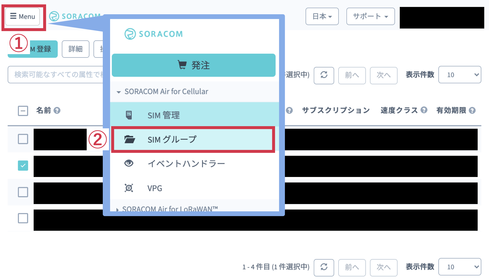
<br><br>

SIMグループ画面で①「追加」を押下し、グループ作成画面を開きます。②「グループ名」に任意のグループ名を入力して③「グループ作成」を押下します。
> 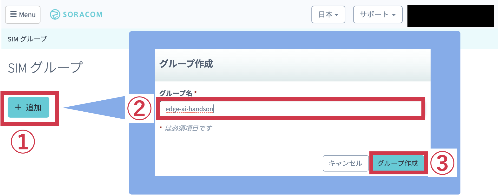
グループ作成が完了するとグループの設定画面が開くのでそのまま手順２を行います。
<br><br>


**手順2. バイナリーパーサーの設定**

　WioLTEからはSORACOM Unifiedendpointに対して。1バイトのデータが送られています。ブザーがなっている場合は最下位ビットが1となり、ブザーがなっていない場合は0が設定されます。（ブザーON: 0x01, ブザーOFF: 0x02)
SORACOMのバイナリーパーサーを使い、1バイトのデータからJSONデータへ変換を行います。

> 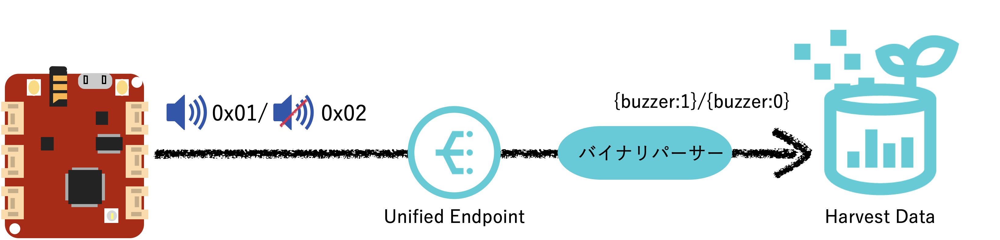
<br><br>

手順１で作成したSIMグループの設定から、「SORACOM Air for Cellular設定」のバイナリーパーサーを①「ON」にします。②「フォーマット」に以下の値を入力し、③「保存」を押下します。

以下の設定は1byteのLSBを符号なし整数として読み取り、buzzerという名前のデータとしてJSON形式に整形する設定になります。

* 参考：[バイナリーパーサーリファレンス](https://dev.soracom.io/jp/docs/binary_parser/)

```
buzzer:0:uint:1:0
```

> 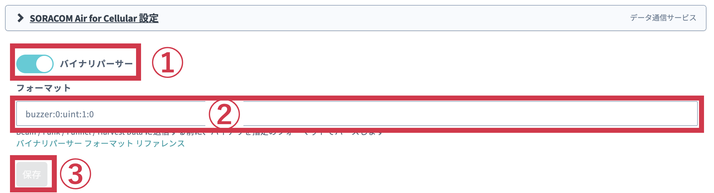
<br><br>


** 手順3. Harvestの設定

SIMグループの設定からHarvestの設定を開き、① Harvestの設定を「ON」にします。その後、②「保存」を押下します。

> 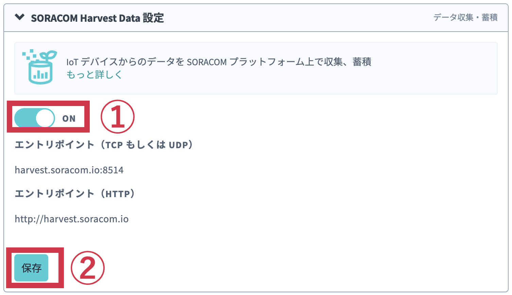
<br><br>


** 手順4. SIMへのグループ設定

SIM一覧からWioLTEに利用しているSIMに①「チェック」を入れて選択します。画面上の②「操作」からプルダウンメニューを表示して、③「所属グループ変更」を押下します。「新しい所属グループ」ダイアログで④作成したSIMグループを選択して、⑤「グループ変更」を押下します。

> 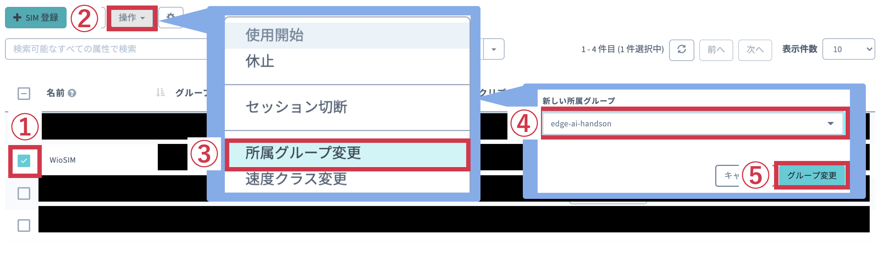
<br><br>

** 手順5. Harvestの確認

WioLTEの電源を入れ、実際にSORACOM Harvestへデータが送信されているか確認します。

SIM一覧からWioLTEに利用しているSIMに①「チェック」を入れて選択します。画面上の②「操作」からプルダウンメニューを表示して、③「データを確認」を押下します。ブラウザ上でSORACOM Harvestの画面が開きます。

> 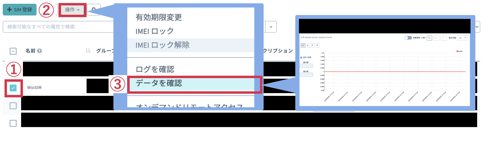
<br><br>

WioLTEからは10秒に1回現在の状態を送信します。また、ブザーのON/OFFが切り替わった際にもデータを送信します。

WIoLTEに接続したスイッチを押下してブザーをON/OFFしながら、ブザーの動作状況がHarvest上で可視化されることを確認します。

## Contribution

修正点や機能追加の提案はGithub issueへの登録、またはプルリクエストの作成をお願いします。

## Licnese

MIT Lisence

## Author

masato-ka jp6uzv@gmail.com

